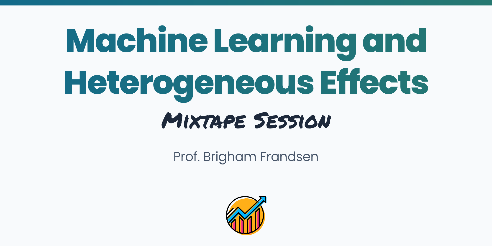

 
 

## About

The holy grail of causal inference is the individual-level treatment effect: how would a particular patient respond to a drug? Which users  will respond most to a targeted ad? Would a given student be helped or harmed by a classroom intervention? This session introduces machine learning tools for estimating heterogeneous treatment effects like random causal forests. The course goes over the theory and concepts as well as the nitty-gritty of coding the methods up in python, R, and Stata using real-world examples. This course can be taken as a follow-up to the Machine Learning and Causal Inference mixtape session, or as a stand-alone course.

## Schedule

1. Review of Machine Learning and Causal Infernece Course
  - Potential outcomes and treatment effects
  - Basic causal inference summary
  - Prediction Target
  - Prediction Methods
  - Prediction mechanics
  - Decision Trees
  - Forest for the Trees
2. Combining causal effects and ML: predicting heterogeneous treatment effects
  - Traditional heterogeneity analysis: Interacted regression
  - Challenges with traditional heterogeneity analysis
  - Predicting outcomes vs. treatment effects
  - Adapting ML to predict treatment effects

## Readings

The following is a set of readings for analyzing heterogeneous effects with machine learning methods:

[Athey and Imbens (2016)](https://github.com/Mixtape-Sessions/Heterogeneous-Effects/raw/main/Readings/Athey_Imbens_2016.pdf)

[Athey, Tibshirani, and Wager (2019)](https://github.com/Mixtape-Sessions/Heterogeneous-Effects/raw/main/Readings/Athey_Tibshirani_Wager_2019.pdf)

[Athey and Wager (2019)](https://github.com/Mixtape-Sessions/Heterogeneous-Effects/raw/main/Readings/Athey_Wager_2019.pdf)

[Wager and Athey (2018)](https://github.com/Mixtape-Sessions/Heterogeneous-Effects/raw/main/Readings/Wager_Athey_2018.pdf)

## Slides

[Heterogeneous Effects](https://github.com/Mixtape-Sessions/Heterogeneous-Effects/raw/main/Slides/ML_Heterogeneous_Effects.pdf)

## Coding Labs

1. [RCT to Regression](https://github.com/Mixtape-Sessions/Heterogeneous-Effects/blob/main/Labs/python/ML_Heterogeneous_Effects.ipynb)

